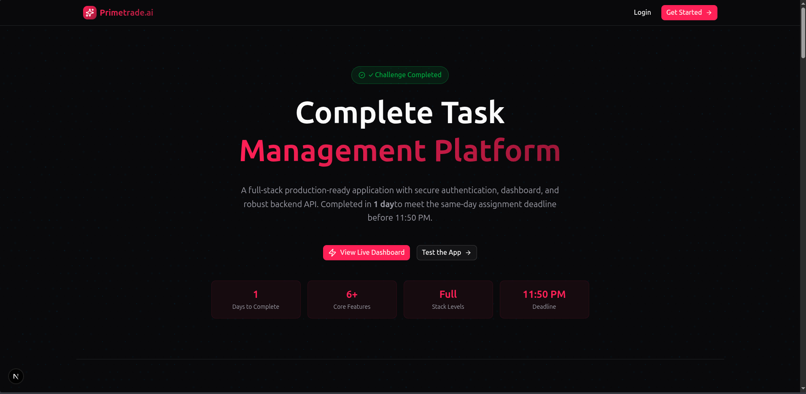
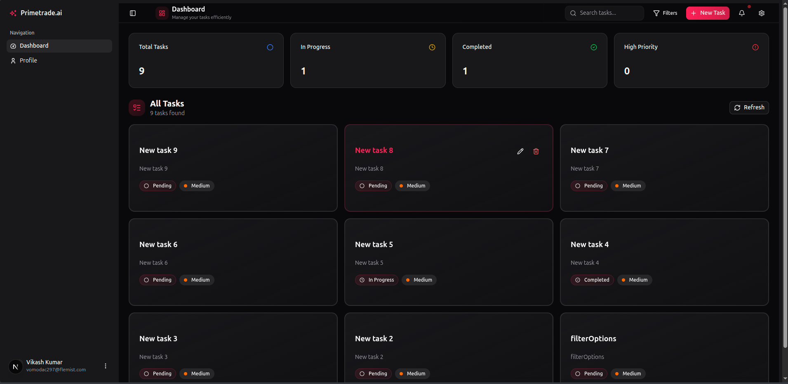
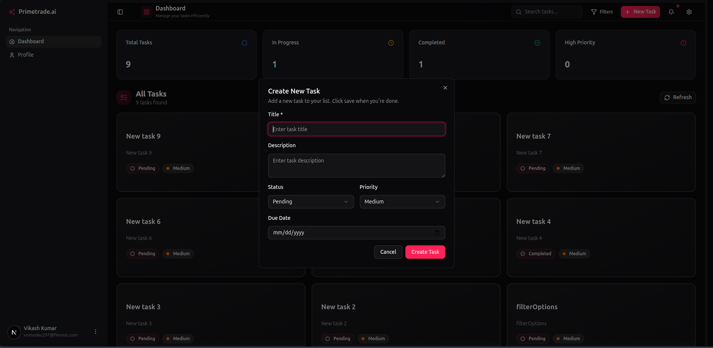
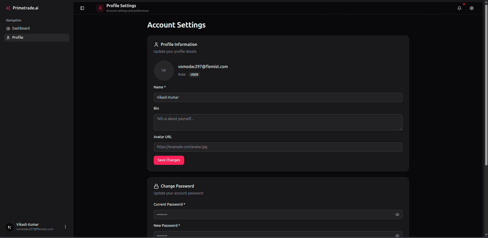

# Frontend - Primetrade AI Task Management Platform

This is the frontend application for the Primetrade AI platform, built with Next.js 16 and TypeScript. It provides a modern, responsive user interface for managing tasks, viewing statistics, and updating user profiles.

> **Note:** This is a separate repository from the backend. The backend API has its own documentation and setup instructions at [Primetrade-AI-Intern-Assignment-BE](https://github.com/vikashkrdeveloper/Primetrade-AI-Intern-Assignment-BE)

## 🚀 Getting Started

### Prerequisites
- **Node.js** (v18 or higher)
- **npm** or **yarn** package manager
- **Backend API running** - Follow setup instructions in the [Backend Repository](https://github.com/vikashkrdeveloper/Primetrade-AI-Intern-Assignment-BE)

### Installation

1. **Clone the repository**
   ```bash
   git clone <frontend-repository-url>
   cd frontend
   ```

2. **Install dependencies**
   ```bash
   npm install
   # or
   yarn install
   ```

3. **Configure environment variables**
   
   Create a `.env.local` file in the root directory:
   ```env
   NEXT_PUBLIC_API_URL=http://localhost:5000/api
   ```
   
   Update the API URL to match your backend server address.

4. **Run the development server**
   ```bash
   npm run dev
   # or
   yarn dev
   ```

5. **Open in browser**
   
   Navigate to [http://localhost:3000](http://localhost:3000)

## 📦 Build & Deploy

### Production Build
```bash
npm run build
npm start
```

### Development Mode
```bash
npm run dev
```

### Linting
```bash
npm run lint
```

## ✨ Features

- **User Authentication** - Secure login and signup with JWT tokens
- **Task Management** - Create, edit, delete, and organize tasks.
- **Dashboard Analytics** - Visual statistics and showing task progress
- **Responsive Design** - Optimized for mobile, tablet, and desktop devices
- **Modern UI** - Beautiful gradients, animations, and interactive backgrounds
- **Dark/Light Mode** - Theme switching support
- **Profile Management** - Update user information and preferences

---

## 📸 Application Screenshots

### Homepage / Portfolio Showcase

*Modern landing page with gradient backgrounds, animated effects, and responsive design showcasing the assignment completion*

### Dashboard - Task Management

*Interactive dashboard with task statistics, charts, and drag-and-drop task organization*

### Create New Task

*Intuitive task creation form with validation and real-time feedback*

### Task Editing

*Seamless task editing with status updates and priority management*

### User Profile

*User profile management with personal information and preferences*

---

## 🛠️ Tech Stack

- **Framework:** Next.js 16 (App Router)
- **Language:** TypeScript
- **Styling:** TailwindCSS 4
- **UI Components:** Shadcn/UI with Radix UI primitives
- **State Management:** React Hooks & Context API
- **Forms:** React Hook Form + Zod validation
- **HTTP Client:** Axios
- **Icons:** Lucide React, Tabler Icons
- **Animations:** TailwindCSS animations, custom canvas effects

## 📁 Project Structure

```
frontend/
├── app/                    # Next.js App Router pages
│   ├── page.tsx           # Homepage/Portfolio showcase
│   ├── login/             # Login page
│   ├── signup/            # Signup page
│   ├── dashboard/         # Protected dashboard routes
│   └── layout.tsx         # Root layout
├── components/            # Reusable components
│   ├── ui/               # Shadcn UI components
│   ├── animated-background.tsx
│   └── dotted-glow-background.tsx
├── hooks/                # Custom React hooks
├── lib/                  # Utility functions
├── public/               # Static assets
└── package.json          # Dependencies and scripts
```

## 🔗 Backend Integration

This frontend connects to the backend API for:
- User authentication (login/signup)
- Task CRUD operations
- User profile management
- Dashboard statistics

**Backend Repository:** [Primetrade-AI-Intern-Assignment-BE](https://github.com/vikashkrdeveloper/Primetrade-AI-Intern-Assignment-BE)

Make sure the backend server is running before starting the frontend application. Refer to the backend README for complete setup and API documentation.

## 🌟 Completed in Record Time

This full-stack application was completed in **1 day** to meet the internship assignment deadline of **11:50 PM** on the same day. The project demonstrates rapid development skills, modern best practices, and attention to detail.

## 📝 Environment Variables

| Variable | Description | Example |
|----------|-------------|---------|
| `NEXT_PUBLIC_API_URL` | Backend API base URL | `http://localhost:5000/api` |

## 🎨 Design Highlights

- Modern gradient backgrounds with animated blobs
- Canvas-based dotted grid with glow effects
- Smooth transitions and hover effects
- Mobile-first responsive design
- Accessible UI components
- Optimized font sizes for all devices

## 📄 License & Submission

This project is part of the Primetrade AI Frontend Developer Internship Assignment.

**Submitted by:** Vikash Kumar  
**Email:** vikash.sde.cseiot@gmail.com  
**GitHub:** https://github.com/vikashkrdeveloper  
**LinkedIn:** https://linkedin.com/in/vikashkrdeveloper

## 🤝 Contact & Support

For any questions or feedback regarding this project:

**📧 Email:** [vikash.sde.cseiot@gmail.com](mailto:vikash.sde.cseiot@gmail.com)  
**💻 GitHub:** [@vikashkrdeveloper](https://github.com/vikashkrdeveloper)  
**🔗 LinkedIn:** [vikashkrdeveloper](https://linkedin.com/in/vikashkrdeveloper)

**Backend Repository:** [Primetrade-AI-Intern-Assignment-BE](https://github.com/vikashkrdeveloper/Primetrade-AI-Intern-Assignment-BE)

---

<div align="center">

**Built with ❤️ for Primetrade AI Internship Assignment**

*Completed in 1 Day | Deadline Met: 11:50 PM ✅*

</div>
